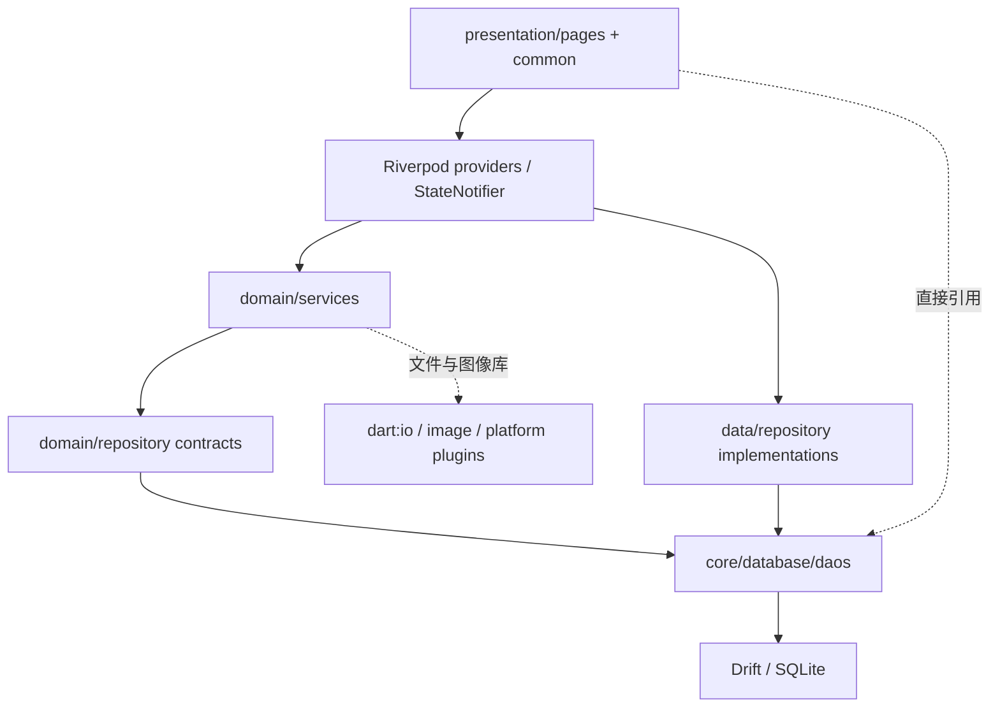
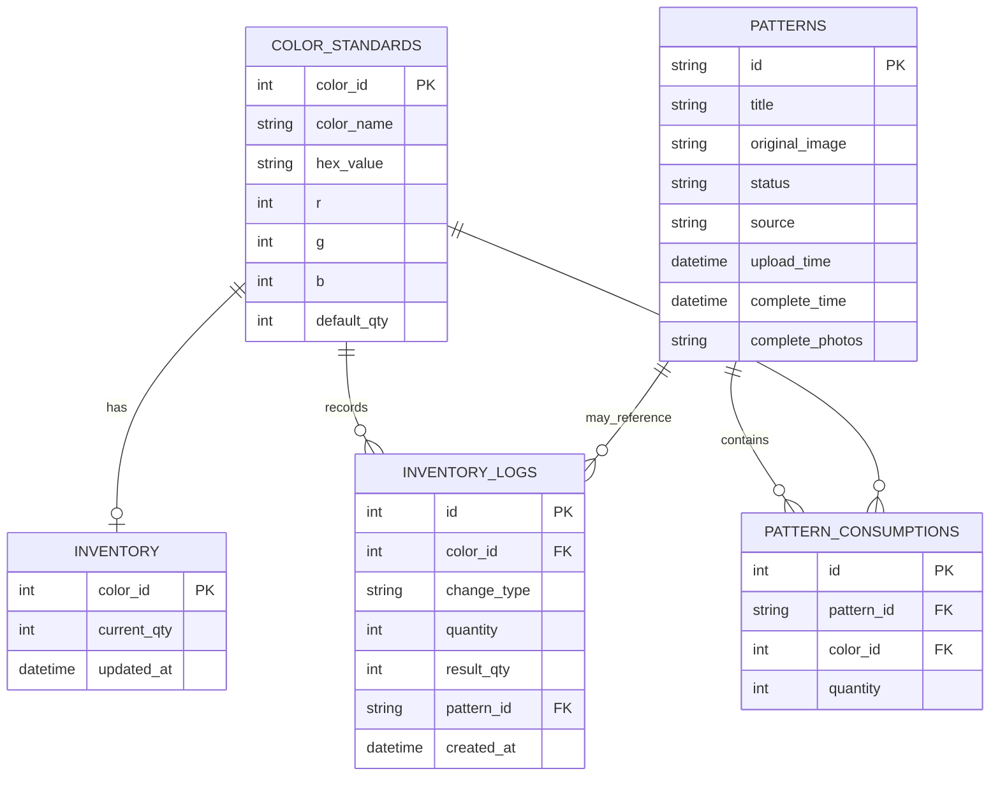

# idou 项目总览与现状审计

> 审计日期：2026-08-11
> 代码基线：`main@958a3f5` / tag `v1.3.7`
> 数据库版本：schema v2
> 当前状态：基本豆仓可用；图纸识别、图片转图纸和图纸—库存闭环未达到可发布标准。

## 1. 项目定位

idou 是一个 Android + Windows 的本地优先拼豆工作台，现有能力围绕三个业务对象展开：

1. `色卡与豆仓`：MARD 221 色、库存数量、补货/消耗、预警和操作日志。
2. `图纸`：上传图纸、识别用色、保存记录、完成记录。
3. `图片转换`：将照片或插画降采样并映射到 MARD 色卡，生成可拼网格。

合理的产品定位不是“泛 AI 应用”，而是：

> 从图片或现成图纸出发，得到可核对、可编辑、可备料、可扣库、可长期保存的拼豆项目。

核心价值在于业务闭环与可信数据，不在于给传统图像算法贴上 AI 标签。

## 2. 当前技术栈

| 类别 | 当前选择 | 评价 |
|---|---|---|
| UI | Flutter / Material 3 | 跨 Android、Windows 合理 |
| 状态 | Riverpod `StateNotifier` | 可用，但页面状态、业务用例和数据状态混杂 |
| 路由 | go_router | 五个主 Tab + 四个全屏流程页 |
| 本地数据 | Drift + SQLite | 方向正确，当前大量 raw SQL 且事务边界缺失 |
| 图像处理 | `image` | 适合纯 Dart 预处理和合成测试 |
| OCR | `flutter_tesseract_ocr` | 可离线，当前解析与质量控制不足 |
| 色差 | CIEDE2000 (`delta_e`) | 适合色卡匹配 |
| 媒体来源 | image_picker | 选图可用，但缓存文件未持久化 |
| 设置 | JSON 文件 | 简单可用，异常被静默吞掉 |
| 更新 | GitHub Releases + 镜像 | Android 有安装流程；Windows 下载后无法安装 |

## 3. 当前代码结构

目录名称呈现 Clean Architecture，但依赖方向并未真正隔离：

- `domain/repositories` 直接使用 DAO 中定义的数据类型。
- `domain/services` 直接依赖 `dart:io`、图片库和 DAO 类型。
- `presentation` 直接构造 Repository 实现、引用 DAO 模型、访问文件系统。
- 缺少 `application` 用例层，跨图纸、库存、日志、文件的操作由页面临时编排。

因此当前更准确的描述是“按层命名的三层应用”，不是严格的 Clean Architecture。

## 4. 页面与业务现状

| 模块 | 已有能力 | 完整度 | 主要缺口 |
|---|---|---:|---|
| 首页 | 库存总量、低库存、最近图纸、快捷入口 | 70% | 阈值使用不统一，数据刷新不联动 |
| 豆仓列表 | 分系列、搜索、排序、卡片加减、详情 | 75% | 空库存行更新失败、错误反馈弱、阈值硬编码残留 |
| 批量库存 | 系列/全选、批量补货和消耗 | 45% | 逐条串行执行、无事务、失败仍提示整体成功 |
| 操作历史 | 按类型筛选、色号与结果数量 | 70% | 缺少关联图纸跳转和撤销/冲正语义 |
| 图纸识别 | 选图、网格区域、OCR、颜色兜底、用量表 | 35% | 准确率、坐标、空白格、逐格编辑、质量门禁均未闭环 |
| 图纸中心 | 列表、详情、改名、删除、完成记录 | 45% | 不保存最终网格；无补扣；图片路径可能失效 |
| 图片转图纸 | 选图、板型、颜色映射、预览、保存入口 | 30% | 原裁剪为假裁剪；无共享编辑器、导出、可靠保存和事务 |
| 设置 | 主题、阈值、默认补货、JSON 导出、初始化/清空 | 55% | 无导入/备份恢复；保存异常静默；危险操作反馈不足 |
| 自动更新 | 版本检查、下载、Android 安装 | 65% | Windows 安装未实现；下载完整性/签名未验证 |

## 5. 当前数据模型

数据模型最大的问题是 `patterns` 没有保存最终网格、行列、识别质量和 `inventory_deducted`。结果是：

- 保存后无法还原用户确认过的图纸，只能显示原图。
- 无法可靠判断是否已扣库存，也无法实现一次性补扣。
- 用量表与图纸矩阵无法对账。
- 图纸识别与图片转换只能各自维护临时内存模型。

## 6. 关键业务链路审计

### 6.1 库存单色操作

当前流程是“查询库存 → 计算新值 → UPDATE → INSERT 日志”。更新和日志不是一个事务；并发或第二步失败时会出现库存与日志不一致。`clearAllData()` 删除库存行后，`updateQuantity()` 只做 UPDATE，不会重新插入行，因此后续补货可能只写日志、不恢复库存记录。

### 6.2 批量库存

UI 逐色调用单色方法，每次调用又会全量刷新库存。它既不是批量 SQL，也不是原子事务。某个色号库存不足时返回 `false`，调用方没有汇总失败，最终仍提示全部完成。

### 6.3 图纸识别与扣库

当前结果页先调用批量扣库，再生成 `patternId` 并保存图纸。因此库存日志没有关联正确的 `pattern_id`；如果图纸保存失败，库存已经扣除。代码注释称“transactional deduction”，实际 Repository 内仍是多次读写且没有 `db.transaction()`。

### 6.4 图片转换与扣库

原实现先保存并导航到图纸中心，再逐色调用普通 `consume()`。库存不足被静默忽略，图纸也没有已扣状态。该链路不能作为正式功能发布。

### 6.5 媒体生命周期

图纸原图和完成照直接保存 `image_picker` 返回路径。该路径可能属于缓存，系统清理或应用升级后会失效。删除图纸也没有清理专属媒体。

## 7. 图像链路现状

项目中同时存在两套识别入口：

- `PatternRecognitionService`：整图缩放后逐像素量化，未被主流程使用，语义也不是“识别图纸”。
- `BeadPatternService + OcrService + GridDetector`：当前主流程，负责网格、OCR 和颜色兜底。

这造成模型、命名和算法重复。正式架构需要明确分成：

1. `图纸识别`：输入已经带网格/色号的图纸，目标是恢复原网格和色号。
2. `图片转图纸`：输入照片/插画，目标是生成新的离散网格，可选择尺寸、色数和背景策略。

两者共享色卡、网格编辑器、用量统计、库存预检、保存与导出，但不应共享同一个“识别算法”入口。

## 8. 已改未验收的工作区

本轮在暂停实现前已经修改 7 个文件，共约 671 行新增、229 行删除，按用户要求保留：

- `grid_detector.dart`：尝试从规则线序列推断任意矩形网格。
- `ocr_service.dart`：调整 hOCR 解析、坐标取整和色号纠错。
- `bead_pattern_service.dart`：增加空白格判断、内缩采样、单格替换。
- `color_matcher.dart`：增加格内主色模式与调色板限制。
- `pattern_generation_service.dart`：增加 29 板型、透明背景和最大颜色数。
- `crop_page.dart`：将示意裁剪替换为可拖动/缩放选区。
- `upload_page.dart`：使用自动行列结果，并增加失败后的手动设置入口。

这些改动没有通过 `flutter analyze`、`flutter test`、格式化和样本准确率验证，不能计为已完成功能。它们还与历史 v1.4 基线中“暂不做图片转换、禁止手动兜底”的范围冲突，需要在实施阶段 0 先评审、取舍和稳定。

## 9. 工程与测试现状

- 仅有 1 个应用烟雾测试、5 个颜色匹配断言和 1 个手工诊断脚本。
- `test/grid_test.dart` 不是标准 `package:test` 测试，且历史上引用过模型中不存在的属性。
- 没有 Repository 事务测试、数据库迁移测试、Provider 测试、识图 ground truth、Golden 测试或端到端测试。
- `flutter analyze` 与 `dart analyze` 在当前环境中均超过 120 秒无输出；`flutter --version` 也无法在 30 秒内返回，需先修复工具链/锁问题再把它解释为代码结果。
- `.gitignore` 只忽略 `dist/build` 和安装包，缺少常见 Flutter/IDE 缓存规则；当前缓存虽未被 Git 跟踪，但工程卫生基线不足。
- 外层 `idou.worktrees/agents-diverse-walrus` 是未注册到 `git worktree list` 的旧副本。由于用户已要求暂停改动，本轮不删除，后续清理阶段再确认处理。

## 10. 竞品与参考结论

参考产品显示，用户真正需要的是一条连贯路径，而不是孤立功能：

- AI 豆仓强调库存、图纸和作品记录，并延伸到色号高亮、镜像和拼豆辅助。
- “我的豆豆”强调自动抠图、智能尺寸、多品牌色卡、画布编辑和 PNG/PDF/CSV 导出。
- “拼豆｜图纸与库存”把颜色限制、相近色合并、扣豆/撤销和库存导入导出放在同一工作台。

idou 不应照搬社区、商城或会员体系。第一阶段应形成差异化：`完全本地 + 数据可信 + 图纸/库存原子闭环 + Android/Windows 双端`。

参考链接：

- https://leobeads.xyz/
- https://www.picturesdou.uk/
- https://apps.apple.com/cn/app/我的豆豆/id6761826491
- https://pindou.org/zh-cn/about

## 11. 审计结论

项目不需要推倒重来。现有 Flutter、Riverpod、Drift、本地 OCR 和 CIEDE2000 都可以保留；需要重做的是业务边界和写入闭环。

优先级必须是：

1. 先恢复可分析、可测试、可迁移的工程基线。
2. 再保证库存与图纸写入绝对一致。
3. 然后完成图纸识别的质量模型和共享编辑器。
4. 最后在相同领域模型上完成图片转换和导出。
