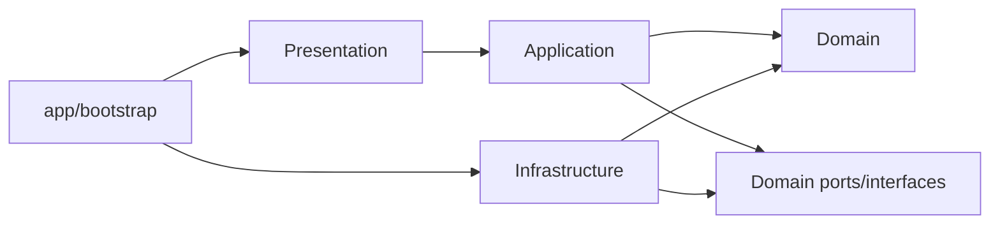
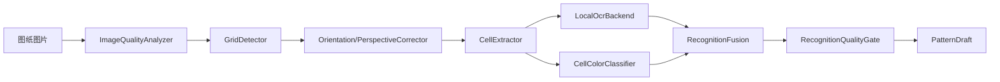
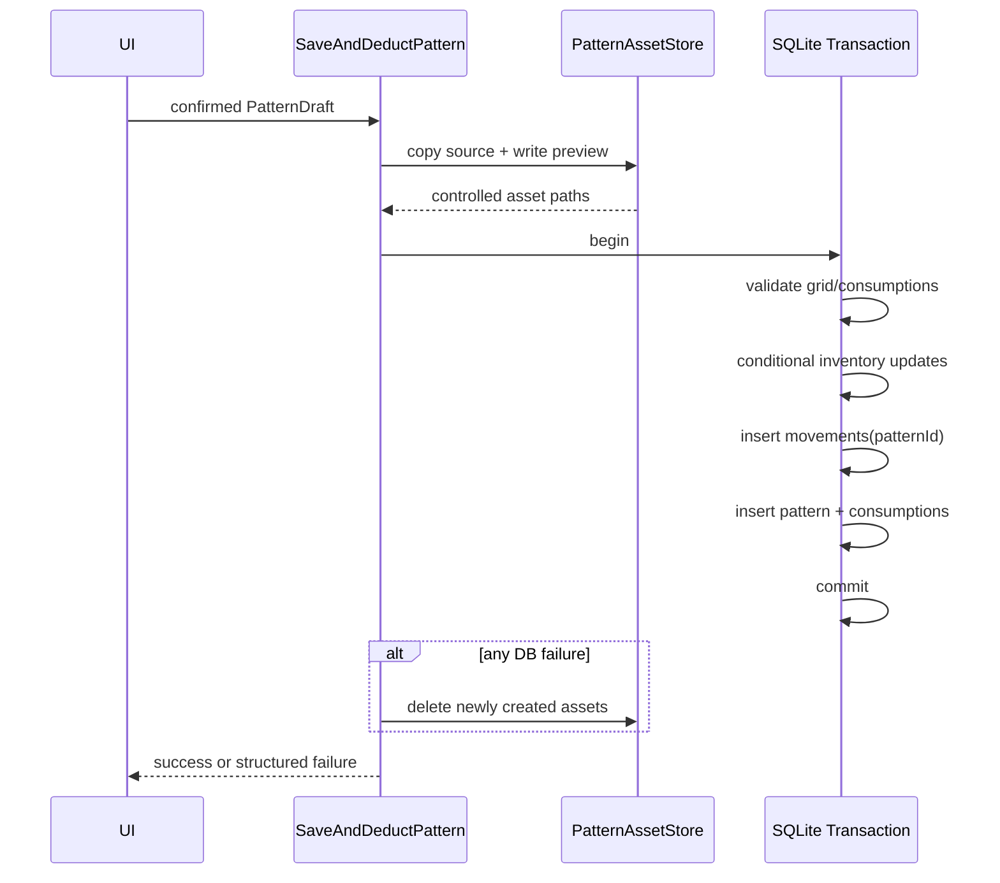

# idou 目标架构

## 1. 架构目标

目标架构服务于四件事：

1. 图纸识别和图片转换可以独立演进，但共享编辑、统计、库存和保存能力。
2. 库存、图纸、日志和媒体文件在一次业务操作中保持一致。
3. 纯 Dart 算法可在 Windows 和测试环境运行，平台 OCR/相册/文件安装通过适配器隔离。
4. 页面只处理交互状态，不再编排 DAO、文件复制和跨仓储事务。

## 2. 分层与模块

```text
lib/
  app/
    routing/
    bootstrap/
  presentation/
    features/
      home/
      inventory/
      patterns/
      recognition/
      conversion/
      settings/
    shared/
  application/
    inventory/
    patterns/
    recognition/
    conversion/
    export/
  domain/
    inventory/
    patterns/
    palette/
    recognition/
    conversion/
    common/
  infrastructure/
    database/
    filesystem/
    imaging/
    ocr/
    export/
    updates/
```

依赖方向固定为：



`domain` 不依赖 Flutter、Drift、`dart:io`、图片插件或 SQL 字段。`application` 可以依赖 domain 接口，但不直接依赖具体 DAO。实现绑定只发生在 bootstrap/provider 组装处。

S1-02 已落地第一条边界：`PatternReader`、`Clock`、`AssetStore`、`OcrPort` 位于 `domain/ports`，`LoadPatterns` 位于 `application`，Drift 图纸读取、系统时钟、本地资源和 OCR 分别由 `infrastructure` 适配器实现。首页“最近图纸”只读流程已通过 `LoadPatterns` 接入；旧写入仓储和详情页暂不迁移，避免在 schema/事务任务之外扩大改动。

S1-03 将 `patterns` 升级为 schema v3：网格事实来源、色卡、预览、识别摘要和扣库状态均有明确字段；v1/v2 旧记录保留原始信息并标记 `legacy`，不伪造网格。迁移规则详见 [S1-03 schema ADR](adr/S1-03-schema-v3.md)。

S1-04 将原图、预览和完成照的生命周期收敛到 `AssetStore`/`PersistAssets`：应用支持目录是唯一持久化根目录，资源先临时写入再原子重命名；数据库提交失败会补偿删除，删除失败进入可重试队列。页面仍需在后续保存用例中接入该端口。

## 3. 核心领域模型

### 3.1 色卡

```text
Palette
  id / name / brand / version
  colors: List<BeadColor>

BeadColor
  id / code / displayName / rgb / lab / attributes
```

色卡与库存分离。即使用户从未初始化库存，也必须能识图和转换。MARD 221 是首个内置 Palette，不再把“内部数字 colorId”等同于用户看到的 MARD 色号。

### 3.2 图纸

```text
Pattern
  id
  title
  sourceType
  paletteId
  grid: PatternGrid
  inventoryState
  sourceAsset
  previewAsset
  createdAt / completedAt

PatternGrid
  rows / columns
  cells: List<PatternCell?>

PatternCell
  colorId
  source       // ocr / color / manual / generated
  confidence
```

`PatternGrid` 是图纸的事实来源；用量清单由它派生并在持久化时对账。空格为 `null`，不计豆子。

### 3.3 库存

```text
InventoryItem
  colorId / quantity / warningThreshold / updatedAt

InventoryMovement
  id / colorId / delta / balanceAfter / reason / patternId / createdAt
```

库存日志采用“变动量 + 变动后余额”的不可变流水。删除图纸不能删除历史流水；需要撤销时新增反向流水，而不是篡改历史。

S2-02 将 `BatchAdjustInventory` 落为单一数据库事务：先汇总全部不足项，再使用带原余额条件的更新检测竞争写入；任一库存更新或流水插入失败时整批回滚。Presentation 只提交一次批量命令，成功后只刷新一次；失败时保留用户选择并显示逐项所需、现有与缺少数量。

S2-03 将 `InventoryState.lowStockThreshold` 作为展示层低量判断的单一快照：设置 Provider 变化时立即重算当前库存集合，不需要再次查询数据库；首页、库存列表、批量页和色号详情均消费同一阈值。库存查询显式区分 loading、empty、error 与 data，重试开始时必须清除旧错误。

S2-04 将全局库存流水改为按 `reason`、色号、时间范围分页查询，并为类型/时间与色号/时间组合建立索引。图纸扣库流水携带 `patternId`，历史页可跳转原图纸；只有图纸扣库允许冲正，同一图纸与色号只能冲正一次。冲正会写入一条相反变动的新流水，原流水始终保留且不允许更新或删除。

## 4. Application 用例

| 用例 | 责任 | 原子边界 |
|---|---|---|
| `LoadInventory` | 查询、排序、筛选和汇总 | 只读 |
| `AdjustInventory` | 单色补货/消耗/设定 | 库存 + 一条流水 |
| `BatchAdjustInventory` | 多色批量补货/消耗 | 所有库存 + 所有流水 |
| `RecognizePattern` | 质量检查、网格、OCR、颜色融合 | 纯计算，无写入 |
| `ConvertImageToPattern` | 裁剪、缩放、背景、调色板、网格 | 纯计算，无写入 |
| `PreviewPatternInventory` | 从网格计算用量并预检 | 只读 |
| `SavePattern` | 资源落盘、图纸与用量保存 | 文件补偿 + DB 事务 |
| `SaveAndDeductPattern` | 保存图纸并一次扣库 | 文件补偿 + 单一 DB 事务 |
| `DeductSavedPattern` | 对未扣图纸补扣一次 | 单一 DB 事务 |
| `CompletePattern` | 持久化完成照和完成时间 | 文件补偿 + DB 事务 |
| `DeletePattern` | 删除记录并清理专属媒体 | DB 事务 + 延迟文件清理 |
| `ExportPattern` | 输出 PNG/PDF/CSV | 只写导出文件 |

## 5. 图纸识别架构



识别输出不只是 `colorId`，而是每格候选、来源、置信度和失败原因。最低要求：

- 网格行列、边界和方向有置信度。
- OCR 与颜色采样使用同一校正后的坐标系。
- 空格是第一类结果，不强制映射为白色。
- 低置信度格可进入编辑，但在用户确认前禁止扣库。
- 大图处理放到 isolate，UI 仅订阅进度和结果。

接口建议：

```dart
abstract interface class RecognitionEngine {
  Future<RecognitionOutcome> recognize(RecognitionRequest request);
}

sealed class RecognitionOutcome {}
final class RecognitionSucceeded extends RecognitionOutcome {
  final PatternDraft draft;
  final RecognitionReport report;
}
final class RecognitionFailed extends RecognitionOutcome {
  final RecognitionFailure reason;
  final Map<String, Object?> diagnostics;
}
```

## 6. 图片转换架构

图片转换不是 OCR。目标管线是：

```text
读取与方向校正
  -> 用户裁剪/自动主体候选
  -> 目标网格尺寸
  -> 采样策略（照片均值 / 像素图中心 / 插画众数）
  -> 背景策略
  -> 色卡匹配
  -> 限色与相近色合并
  -> 小孤点清理、轮廓连续性修正
  -> PatternDraft
```

首版不需要云端生成模型。应先把确定性、可离线、可回归的转换引擎做好；“AI 抠图”可作为后续可插拔 `SubjectSegmentationBackend`。

## 7. 共享图纸编辑器

识别和转换都进入同一个 `PatternEditor`：

- 双指/滚轮缩放、平移。
- 点击/拖动绘制、橡皮、填充、拾色。
- 当前色号与相近色候选。
- 撤销/重做命令栈。
- 行列号、主次网格线和色号标注开关。
- 用量统计、低库存和不足数量实时刷新。
- 颜色合并操作可撤销，不直接破坏原始识别结果。

编辑器状态使用不可变 `PatternDraft`；算法结果、用户修正和保存后的 `Pattern` 分开，避免页面直接修改二维 List。

## 8. 数据库目标

建议 schema v3 在现有表上增量迁移：

### `patterns` 新增

| 字段 | 类型 | 说明 |
|---|---|---|
| `palette_id` | TEXT | 使用的色卡 |
| `grid_rows` | INTEGER | 行数 |
| `grid_cols` | INTEGER | 列数 |
| `grid_json` | TEXT | 最终网格及格子元数据 |
| `inventory_deducted` | INTEGER | 0/1，只允许从 0 到 1 或经冲正回退 |
| `preview_image` | TEXT nullable | 受控预览图路径 |
| `recognition_report` | TEXT nullable | 识别质量摘要，不保存大量原始像素 |

### 约束与索引

- `inventory.current_qty >= 0`。
- `pattern_consumptions.quantity > 0`。
- `UNIQUE(pattern_id, color_id)` 保留。
- `inventory_logs.pattern_id` 建索引。
- `patterns(created_at, status)` 建组合索引。
- 开启并测试 SQLite foreign keys。

迁移必须覆盖 v1 → v2 → v3 和 v2 → v3；旧图纸没有网格时标记为 `legacy`，仍可查看原图和用量，不伪造网格。

## 9. 事务与媒体一致性

保存并扣库的顺序：



关键规则：

- `patternId` 在事务前生成，所有库存流水都携带它。
- 库存不足为正常业务结果，不用异常字符串表达。
- 使用条件 UPDATE 并检查受影响行数，避免“先读后写”的并发窗口。
- 数据库提交成功、媒体清理失败时写入待清理队列，不能回滚已经提交的库存事实。

## 10. 状态管理

Provider 分为三类：

1. `依赖组装 Provider`：Database、Repository、Engine、AssetStore。
2. `查询 Provider`：库存快照、图纸列表、图纸详情，失效规则明确。
3. `流程 Controller`：识别、转换、编辑、保存的有限状态机。

流程状态示例：

```text
idle -> picking -> processing(progress) -> review(draft/report)
     -> saving -> saved
     -> failure(reason, retryAction)
```

页面不再通过 `GoRouterState.extra as Map<String,dynamic>` 传递复杂可变业务数据。短流程使用强类型参数对象；需要跨导航存活的草稿由 `autoDispose` Controller 管理。

## 11. 错误与可观测性

- 定义受控错误类型：输入质量、网格失败、OCR 不可用、库存不足、媒体失败、数据库失败、迁移失败。
- UI 显示用户可行动的信息；诊断详情只进入本地日志/导出诊断包。
- 不再使用空 `catch (_) {}`。允许忽略的清理失败也要记录。
- 识图报告记录各阶段耗时、网格候选、空格比例、OCR 命中率、低置信度比例。

## 12. 测试架构

| 层级 | 内容 | 是否依赖平台 |
|---|---|---|
| L0 静态 | format、analyze、依赖规则 | 否 |
| L1 单元 | 色号解析、色差、网格模型、用量、质量门禁 | 否 |
| L2 合成图 | 网格检测、OCR fake 融合、转换算法、扰动 | 否 |
| L3 数据 | DAO、事务、迁移、失败回滚 | SQLite 本地 |
| L4 Widget | 豆仓、编辑器、错误状态、导航 | Flutter test |
| L5 真机 | Tesseract、相机/相册、性能、安装更新 | Android/Windows |

每个识图/转换样本必须有 manifest 与 ground truth，测试比较网格尺寸、非空掩码、逐格色号和用量，不以“能生成图片”作为成功标准。

## 13. 允许删除或合并的对象

以下仅在引用迁移和测试通过后删除：

- 未使用且语义错误的 `domain/services/pattern_recognition_service.dart`。
- DAO 文件中的领域模型与 `toMap/fromMap`，迁移到 infrastructure mapper 后删除。
- 重复的库存薄包装 `InventoryService`；若 application 用例已建立，不再保留无业务逻辑转发层。
- 页面内重复的色卡构造、用量统计和库存预检代码。
- 未注册的外层旧 worktree 副本。

生成文件 `app_database.g.dart` 继续由 build_runner 管理，不手工编辑。
