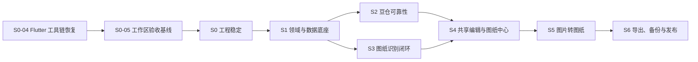

# idou 实施计划书

> 计划类型：架构收敛 + 核心功能补全
> 计划原则：先稳定、再一致、后算法、最后体验；任何阶段都不以界面“能点”替代闭环验收。

> 2026-08-13 执行状态：S0-04 Flutter 工具链恢复与 S0-05 工作区验收基线均已完成。下一顺序为补齐 S2-02、S2-03、S2-04 的验收，再从 S3-01 开始图纸识别；已有越序实现继续保留，但不得据此宣称相关任务完成。

## 1. 总体路线

建议按 6～9 周的单人全职节奏规划；若为业余开发，按阶段交付，不承诺日历日期。每阶段都可形成一个可回退的提交或版本标签。

## 2. 阶段 0：恢复 Flutter 工具链与重建工程基线

预计：2～4 天。

### 目标

首先恢复可复现的 Flutter 开发、依赖解析和测试环境，再回答“当前工作区能否编译、哪些改动达到验收标准”。本阶段不增加产品功能。

### 工作项

1. 执行 S0-04：定位 `D:\flutter\bin\cache\lockfile` 无法访问、Flutter 命令无输出/超时和 SDK/PATH/残留进程问题。
2. 排查 Dart/Flutter 测试在 native-assets FFI 转换阶段出现的 `InvalidType is not a subtype of FunctionType`，形成最小复现并修复环境或依赖配置。
3. 依次恢复 `flutter doctor -v`、`flutter --version`、`flutter pub get`、focused test、`flutter analyze` 和 `flutter test`；记录命令、耗时和输出。
4. 执行 S0-05：将当前所有修改和新增文件映射到唯一任务，区分完整实现、部分实现、测试脚手架和越序实现。
5. 重跑 S0～S2 的关键回归，重新核对 S3～S6 的任务状态、依赖和验收证据。
6. 现有业务实现保持原样；只有替代路径、引用迁移和完整测试均通过后才允许删除。

### 退出门禁

- Flutter/Dart 版本、依赖解析和诊断命令在 120 秒内稳定返回。
- SDK lockfile 可访问，native-assets FFI 不再在测试执行前崩溃。
- `dart format --output=none --set-exit-if-changed lib test`、`flutter analyze`、focused tests 和 `flutter test` 可重复运行。
- 当前工作区所有修改均有任务归属和验收状态；没有未解释的编译错误、测试假阳性或越序解锁。

## 3. 阶段 1：领域模型与数据底座

预计：4～6 天。

### 目标

建立不依赖 UI/DAO 的色卡、图纸、库存模型和 application 用例边界。

### 工作项

1. 建立 `domain/palette`、`domain/patterns`、`domain/inventory`。
2. 将 DAO 内的 `PatternItem`、`InventoryWithColor` 等过渡模型迁出。
3. 定义 Repository/AssetStore/OCR/Clock 接口和结构化结果类型。
4. 建立 schema v3：图纸网格、行列、色卡、扣库状态、预览和识别摘要。
5. 编写 v1→v2→v3、v2→v3、旧图纸兼容迁移测试。
6. 实现 `PatternAssetStore` 的临时写入、原子重命名和补偿删除。
7. 建立统一的枚举/值对象：来源、状态、库存原因、识别失败。

### 退出门禁

- Domain 单元测试不初始化 Flutter。
- 新安装和两条升级路径测试通过，旧数据数量与关键字段不丢失。
- 页面不再新增对 DAO 模型的直接依赖。

## 4. 阶段 2：豆仓可靠性与体验

预计：4～6 天。

### 目标

把“基本能用”的豆仓变成数据可信的库存子系统。

### 工作项

1. 实现 `AdjustInventory`：补货、消耗、设定数量与流水同事务。
2. 将 `updateQuantity` 改为明确的 upsert/conditional update 语义，修复清空后无法恢复。
3. 实现 `BatchAdjustInventory`，替换 UI 逐色循环和多次全量刷新。
4. 所有数量输入统一校验，库存不得小于 0。
5. 统一低库存阈值，修改设置后首页、列表、详情即时刷新。
6. 批量操作返回成功/不足/失败明细，不再无条件提示整体成功。
7. 操作历史增加关联图纸与 reason 类型；保留不可变流水。
8. 完善空状态、错误状态、重试和危险操作反馈。

### 退出门禁

- 单色和批量操作的故障注入测试证明零部分写入。
- 清空后补货、初始化后消耗、并发条件更新均通过。
- 221 色列表滚动和搜索无明显卡顿。

## 5. 阶段 3：图纸识别闭环

预计：8～12 天。

### 目标

从清晰数字图纸开始，完成“自动识别 → 核对 → 预检”的稳定只读链路。

### 工作项

1. 建立授权明确的合成样本生成器、manifest 和 ground truth。
2. 定义 `RecognitionEngine`，拆分质量检查、网格候选、单元格提取、OCR、颜色分类、融合和质量门禁。
3. 统一方向、缩放、裁剪和 OCR 坐标系。
4. 自动估算任意矩形行列，处理数字图、截图、扫描和轻度倾斜。
5. 建立空格、白色豆、浅色豆和文字覆盖的专门样本。
6. OCR 输出候选与置信度；颜色输出 CIEDE2000 距离；融合保留来源。
7. 后台 isolate 处理、可取消、阶段进度和结构化失败提示。
8. 先达到合成图门槛，再进入真实图纸真机测试。

### 退出门禁

- 合成图和扰动集达到需求文档中的算法指标。
- 低质量/大量未知格结果不会进入扣库动作。
- 识图结果包含完整 `PatternDraft + RecognitionReport`。

## 6. 阶段 4：共享编辑器与图纸闭环

预计：7～10 天。

### 目标

让识别结果成为可编辑、可保存、可扣库、可重新打开的真实图纸。

### 工作项

1. 实现共享 PatternEditor：缩放、选格、画笔、橡皮、填充、拾色。
2. 建立命令式撤销/重做，颜色合并也进入命令栈。
3. 实时用量聚合、库存预检、低置信度筛选。
4. 实现 `SavePattern` 和 `SaveAndDeductPattern`，包含媒体补偿与单一 DB 事务。
5. 图纸列表/详情显示来源、尺寸、色数、豆数、扣库状态。
6. 实现 `DeductSavedPattern`，以条件状态更新保证只扣一次。
7. 完成照复制到受控目录；删除图纸走资源清理队列。
8. 旧图纸以 legacy 模式查看，不伪造网格。

### 退出门禁

- 重启应用后图纸网格、用量、资源和扣库状态完整恢复。
- 保存并扣库在库存不足、图片失败、DB 失败时均无部分写入。
- 用量表与网格对账差异为 0。

## 7. 阶段 5：图片转图纸

预计：7～12 天。

### 目标

在共享图纸模型和编辑器之上完成确定性的本地图片转换。

### 工作项

1. 验证并收敛当前工作区的真实裁剪交互与坐标映射。
2. 支持 29/52/78/104 和 16～156 自定义尺寸。
3. 实现照片均值、像素图中心、插画众数三种采样策略。
4. 背景移除从固定亮度阈值升级为边缘连通背景/可配置容差，保护浅色豆。
5. 实现调色板限制、低频色合并、相近色合并，所有操作可撤销。
6. 增加可开关的去孤点、补缺口和轮廓优化。
7. 转换结果进入同一个 PatternEditor、保存和扣库用例。
8. 基于样本评估自动尺寸推荐；未达稳定门槛则保留手动选择。

### 退出门禁

- 同一输入和参数产生确定性结果。
- 浅色主体、白背景、透明 PNG、像素图和照片样本均有回归测试。
- 转换页不再有独立保存/扣库实现。

## 8. 阶段 6：导出、备份与发布

预计：5～8 天。

### 工作项

1. PNG 导出：透明/白底、色号、行列号、主次网格。
2. PDF 打印：分页、图例、用量和缺口。
3. CSV 用料导出与完整本地备份/恢复。
4. Android/Windows 媒体权限、文件选择和大图性能验收。
5. 更新包增加 SHA-256 校验；补齐 Windows 更新策略或明确禁用安装按钮。
6. 发布前数据库备份、迁移演练和回滚说明。
7. 清理过时服务、重复页面逻辑、废弃文档和旧工作树。

### 退出门禁

- 全量测试与真机矩阵通过。
- 离线核心流程通过。
- 发布包版本、数据库版本、更新元数据和变更日志一致。

## 9. 依赖关系与并行策略

不可并行的硬依赖：

- schema v3 和领域模型必须早于正式保存/扣库闭环。
- 共享编辑器必须早于图片转换的正式保存逻辑。
- 工具链恢复必须早于任何“测试通过”声明。

当前不安排并行业务开发。S0-04 和 S0-05 完成后，仍遵守任务板 `max_in_progress: 1`，一次只执行一个可验证任务；只有在未来明确拆分为无共享写入、独立验收的任务时，才重新评估并行策略。

## 10. 风险登记

| 风险 | 概率 | 影响 | 应对 |
|---|---:|---:|---|
| Tesseract 对小格文字命中率不足 | 高 | 高 | 多尺度预处理、整图/分区策略、颜色融合、质量门禁 |
| 图纸版式差异导致网格误判 | 高 | 高 | 候选评分、合成扰动集、结构化失败，不用硬编码板型 |
| 浅色背景与白色豆混淆 | 高 | 高 | 空格掩码与色号 OCR 联合，不用单阈值做最终判断 |
| 旧库迁移破坏数据 | 中 | 极高 | 真实旧库副本 + 自动备份 + 迁移事务 + 校验报告 |
| 大网格编辑卡顿 | 中 | 高 | 可见区域绘制、CustomPainter、增量统计、命令差量 |
| 当前未验收改动扩大返工 | 高 | 中 | 阶段 0 逐文件决策，不继续在其上堆功能 |
| 需求继续横向扩张 | 中 | 高 | 需求 ID、阶段门禁、P2 候选区，社区/云端明确排除 |

## 11. 提交与版本策略

每个阶段使用小而可回退的提交：

1. 纯重构与行为变更分开。
2. schema migration 与使用新字段的业务代码同一阶段交付，但拆成可审查提交。
3. 每次删除文件前先完成引用迁移和测试。
4. 不手改生成文件；生成结果与 schema 源文件一同提交。
5. 标签只在发布门禁通过后创建；预发布使用 `-alpha.N` / `-beta.N`。

建议版本：

- `1.4.0-alpha.N`：阶段 0～2，豆仓可靠性和数据底座；用于内部 QA，不创建稳定版标签。
- `1.4.0-beta.N`：阶段 3～5，依次验证图纸识别、图纸闭环和图片转图纸。
- `1.4.0`：阶段 6 完成并通过全部发布门禁后的首个整体正式版本。

## 12. Definition of Done

任一需求只有同时满足以下条件才算完成：

1. 需求 ID 与验收标准明确。
2. Domain/Application 边界符合目标架构，无新增反向依赖。
3. 正常、业务失败、基础设施失败均有自动化测试。
4. format、analyze、test 通过。
5. 涉及数据库时迁移与回滚路径已验证。
6. 涉及图片时有受控样本和 ground truth。
7. 涉及用户数据时无部分写入、无缓存路径、无静默失败。
8. 文档和需求追踪表更新。
9. Android/Windows 相关平台验收完成，或明确标注平台限制。

## 13. 下一次实施的第一批任务

严格按以下顺序继续：

1. S2-02：补齐批量库存失败注入、条件更新和 Widget 门禁。
2. S2-03：补齐阈值跨页面联动与加载/空/错误/重试 Widget 门禁。
3. S2-04：补齐流水 patternId 跳转、分页/筛选/索引和冲正防重门禁。
4. S3-01：完善样本生成、manifest 和机器可比较指标报告；随后按顺序执行 S3-02～S3-05。
5. S3 全部通过后，依次完成 S4 编辑 UI、保存和库存事务闭环。
6. 再执行 S5 图片转图纸和 S6 导出、备份、双平台及发布验收。

详细文件归属和验收缺口以 `docs/WORKTREE_BASELINE.md` 为准。
