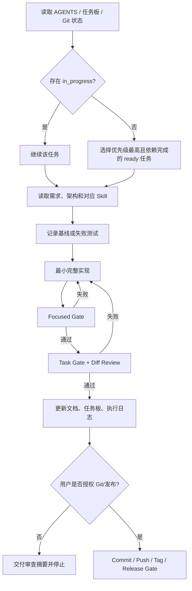

# idou AI 全流程执行计划

> 目标：让 AI 可以在多轮会话中稳定地完成“理解任务 → 开发 → 测试 → 验证 → 文档 → Git 交付 → 发布确认”，且随时可暂停、审查和续跑。

> 当前执行指令（2026-08-13）：S0-04 与 S0-05 已完成，当前无 `in_progress` 任务。按阶段优先级依次选择 `ready` 的 S2-02、S2-03、S2-04，再执行 S3-01；文件归属与验收缺口见 `docs/WORKTREE_BASELINE.md`。

## 1. 控制文件

| 文件 | 作用 | 更新时机 |
|---|---|---|
| `AGENTS.md` | 全仓强制规则、架构边界、数据安全、Git 权限 | 规则变化时 |
| `docs/AI_TASKS.yaml` | 唯一任务状态、依赖、验收和门禁 | 每个任务开始/结束 |
| `docs/AI_PROGRESS.md` | 执行证据、命令结果、阻塞和下一步 | 每次工作会话 |
| `docs/RELEASE_CHECKLIST.md` | 候选版本验证、制品和远端交付记录 | 发布候选阶段 |
| `.agents/skills/**` | 总流程和专业领域操作手册 | 工作流发生稳定变化时 |

## 2. AI 单任务循环



任何时刻全仓最多一个 `in_progress` 任务。AI 不因为“顺手”开始第二个功能，也不因 token、时间或工具不可用把未验证任务标成完成。

## 3. 门禁层级

### Gate 0：Flutter Toolchain（当前首要门禁）

- `flutter doctor -v`、`flutter --version`、`dart --version`、`flutter pub get` 在 120 秒内稳定返回。
- `D:\flutter\bin\cache\lockfile` 可访问，不再因权限、占用或残留进程阻塞。
- focused `dart test`/`flutter test` 能真正开始并完成测试，不在 native-assets FFI 转换阶段崩溃。
- 记录 SDK、PATH、依赖解析、缓存、进程、命令耗时和原始失败输出。
- Gate 0 未通过时，禁止把任何依赖 Flutter 门禁的任务标记为 `done`。

### Gate A：Baseline

- 当前行为可复现，或测试先失败。
- Git 状态、用户已有修改和允许范围明确。
- 需求 ID、依赖与验收标准明确。

### Gate B：Focused

- 格式化涉及文件。
- 运行本模块最小单元/Widget/Repository/样本测试。
- 新增行为至少有成功和失败测试。

### Gate C：Task

- `dart format --output=none --set-exit-if-changed lib test`
- `flutter analyze`
- `flutter test`
- 专业 Skill 要求的迁移、图像指标或平台测试。
- 最终 diff 没有无关改动、反向依赖、临时文件和部分写入。

### Gate D：Release

- Task Gate 全部通过。
- Android/Windows 目标构建通过。
- 数据库升级、离线核心路径和真实设备验证通过。
- 版本、schema、更新元数据、变更日志、制品名和哈希一致。
- 用户明确授权 commit、push、tag 或 publish。

## 4. Skill 路由

| 任务内容 | 必用 Skill |
|---|---|
| 任一计划任务 | `idou-execute-plan` |
| 网格、OCR、颜色、裁剪、转换、编辑算法 | `idou-image-pipeline` |
| Drift、库存、图纸、媒体、迁移、备份 | `idou-data-integrity` |
| 全量验证、版本、构建、Git、标签和发布 | `idou-release` |

多个领域同时涉及时按顺序使用：`execute-plan → 专业 Skill → release（仅交付阶段）`。

## 5. 阶段推进

### S0 工程基线

先执行 S0-04，恢复 Flutter SDK lockfile、依赖解析、native-assets 和测试运行器；再执行 S0-05，审计当前全部修改并建立可信 format/analyze/test 基线。两项未通过前禁止继续扩展算法、UI、持久化、转换或发布能力。

### S1 领域与数据底座

建立 `BeadColor/PatternGrid/PatternDraft`、application ports、schema v3 和受控媒体存储。新架构通过测试后再逐步迁移页面。

### S2 豆仓可靠性

完成单色/批量原子库存、统一阈值、流水和错误反馈，先让基本豆仓达到可信状态。

### S3 图纸识别

以合成 ground truth 为入口，逐步完成网格、OCR、颜色、融合、质量门禁和 isolate；不能从 UI 截图判断完成。

### S4 编辑与图纸闭环

完成共享编辑器、仅保存、保存并扣库、补扣、媒体与重新打开；所有写入由 application 用例协调。

### S5 图片转图纸

完成真实裁剪、尺寸/采样、背景、限色和轮廓处理，最终进入同一编辑与保存闭环。

### S6 导出与发布

完成 PNG/PDF/CSV、备份恢复、双平台验证、版本和制品交付。

具体任务与依赖只在 `AI_TASKS.yaml` 维护，避免计划文档和实际状态分叉。

## 6. Git 全流程

AI 完成任务后默认停在“已验证、未提交”，输出：

1. 任务/需求 ID。
2. diff 摘要与关键设计决定。
3. 完整测试命令和结果。
4. 文档更新。
5. 风险和下一任务。

用户授权提交后，使用任务级提交，例如：

```text
fix(inventory): make quantity adjustment atomic [INV-004]
feat(patterns): persist confirmed pattern grid [PAT-001]
test(recognition): add blank-versus-white regression set [REC-005]
```

用户授权推送/发布后，AI 再执行 Release Gate、推送并验证远端状态。未经当次授权，不推送、不打标签、不创建 Release。

## 7. 数据库和破坏性操作

- schema 变更必须先写迁移测试，再升级 `schemaVersion`。
- 测试旧库使用副本，禁止在开发验证中直接迁移唯一用户数据库。
- 删除文件前列出引用、确认替代已生效、验证绝对路径。
- 删除图纸不会删除库存历史；库存撤销使用冲正流水。
- 任何媒体/DB 跨边界操作都需要失败补偿测试。

## 8. 阻塞处理

阻塞记录必须包括：

- 精确命令/操作。
- 完整错误或超时。
- 已尝试的安全诊断。
- 未满足的验收条件。
- 下一步需要的权限、输入或环境变化。

工具链不可用时允许继续做只读审计和测试设计，但不得继续堆叠无法编译的产品实现。

当前已知 Flutter 阻塞基线：

- Flutter wrapper、`flutter pub get` 和 focused Flutter tests 曾在 SDK lockfile 访问处超时或失败。
- 直接 Dart SDK 可执行，`dart analyze lib test` 无 error，但不能替代 Flutter 门禁。
- `dart test` 曾在 native-assets FFI 转换阶段以 `InvalidType is not a subtype of FunctionType` 崩溃，测试主体未执行。
- `tool/pure_editor_regression.dart` 通过仅证明纯领域命令不变量，不得用来解锁 Widget、Golden、平台或全量测试。

恢复顺序固定为：诊断 SDK/进程/权限 → 恢复依赖解析 → 最小 Flutter smoke → focused tests → format/analyze/full tests → S0-05 验收基线审计。

## 9. 用户调用方式

推荐后续直接使用：

- “按 AI 计划继续下一项。”
- “执行任务 `S2-01`，完成到测试和文档，不提交。”
- “验证当前任务，失败就修复，全部通过后给我提交方案。”
- “按发布 Skill 准备候选版本，不推送。”
- “门禁通过后提交并推送当前任务。”

AI 必须仍以任务板状态和权限规则为准，不把自然语言中的“继续”解释为自动推送或发布。
